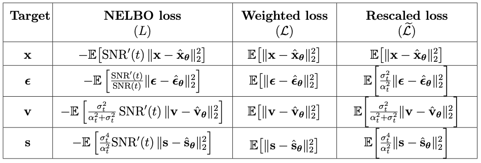
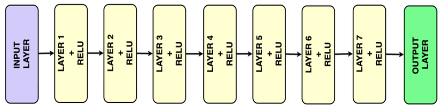
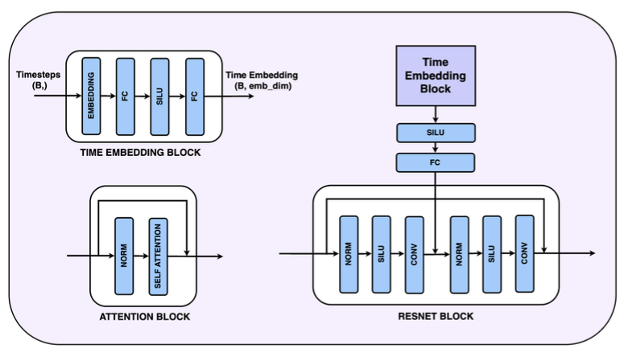
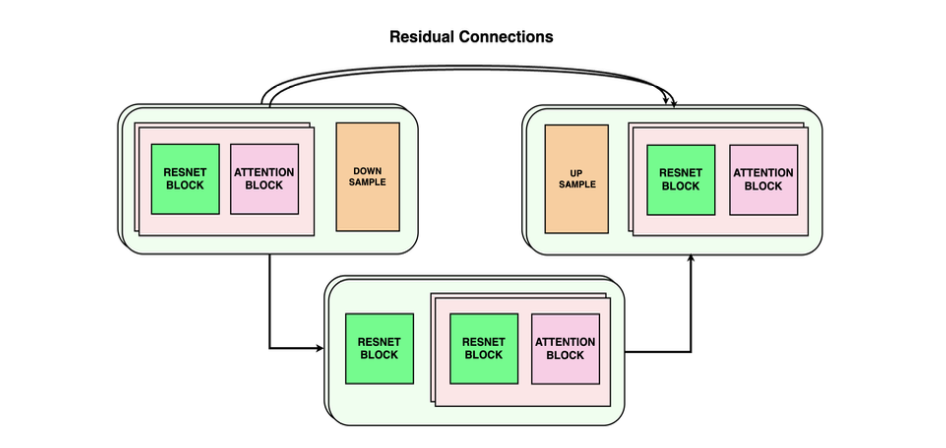

## Loss Functions in Diffusion Models: A Comparative Study

Diffusion models have established themselves as highly effective generative frameworks, inspiring significant research into their underlying mechanisms. An important aspect of these models lies in the choice of loss functions, which directly influences their training and performance. In this study we provide a comprehensive exploration of these loss functions, systematically analyzing their theoretical relationships and unifying them under the framework of the variational lower bound objective. We complement this analysis with empirical studies that examine the conditions under which different objectives yield varying performance and provide insights into the factors driving these discrepancies. Additionally, we assess the impact of loss function selection on the model’s ability to achieve specific objectives, such as producing high-quality samples or precisely estimating data likelihoods.By presenting a unified perspective, this study advances the understanding of loss functions in diffusion models, contributing to more efficient and goal-oriented model designs in future research.

The table below provide an overview of all the loss formulations across different scenarios. While the NELBO and the rescaled loss are equivalent and comparable, the weighted
losses are not equivalent and are expected to exhibit different empirical performance.

## Instructions for Code

This repository supports experiments on two types of datasets:

1. **2D Datasets**: 
   - Cluster data
   - Ring data
   - Swiss roll data
   - Waves data

2. **Image Dataset**: 
   - CIFAR10

### Jupyter Notebooks

The experiments are conducted using two main Jupyter notebooks:

#### 1. **`main2D.ipynb`** (For 2D Datasets)
   This notebook is designed for running experiments on 2D datasets. The following parameters can be adjusted to customize the experiments:

   - **`data_type`**: Specifies the dataset to use. Options include:
     - `'Cluster_data'`
     - `'Ring_data'`
     - `'Swiss_roll_data'`
     - `'Waves_data'`

   - **`scale_type`**: Defines the scaling method. Options include:
     - `'ELBO'`
     - `'Weighted'`

   - **`loss_formulation`**: Selects the loss formulation for training. Options include:
     - `diffusion_loss_x`
     - `diffusion_loss_epsilon`
     - `diffusion_loss_v`
     - `diffusion_loss_score`

   - **`sample_type`**: Chooses the sampling method for generating data from the trained model. Options include:
     - `sampling_x`
     - `sampling_epsilon`
     - `sampling_v`
     - `sampling_score`

   - **Other Boolean Flags**:
     - `t_embed`: enable or disable time embedding
     - `plot_loss_by_time`: visualize the loss over time
     - `plot_samples`: plot samples generated by the model
     - `save_params`: save model parameters

#### 2. **`mainImages.ipynb`** (For CIFAR10 Image Dataset)

This notebook is designed for running experiments on the CIFAR10 dataset. The following parameters can be configured, similar to those in `main2D.ipynb`:

- **`loss_formulation`**: Select the desired loss function for training.
- **`scale_type`**: Specify the scaling method to use.
- **`sample_type`**: Choose the sampling method for generating data from the trained model.

**Note:** The performance of image-based models, particularly score-based models, may not be optimal. Precise computation for continuous-time diffusion models in high-dimensional image spaces (like CIFAR10) requires modeling both reverse and forward Stochastic Differential Equations (SDEs), which is not in the scope of this research.

Additionally, the **`num_steps`** parameter is used to control the number of reverse diffusion steps during sampling.

#### **Boolean Flags:**
The following boolean flags can be used to customize the experiment:

- **`plot_loss_by_epochs`**: Plot the loss versus epochs graph.
- **`plot_loss_by_time`**: Plot the loss versus time graph.
- **`generate_samples`**: Generate and display samples from the trained model.
- **`save_params`**: Save the model parameters after training.
- **`save_losses`**: Save the loss values during training.

<!-- ## Model

For modeling the 2D dataset we used a very simple neural network architecture with 7 fully connected layers and ReLU ativation as shown below. 

To model CIFAR10 we used the UNET architechture , with downsampling blocks that reduces the spatial dimensions, mid blocks, working at a same resolution and upsampling blocks that increase the spatial resolution and have residual connections from the corresponding down sample block.

 -->
<!-- 

## Results

The table results for 2D dataset and Image dataset are as follows, -->

